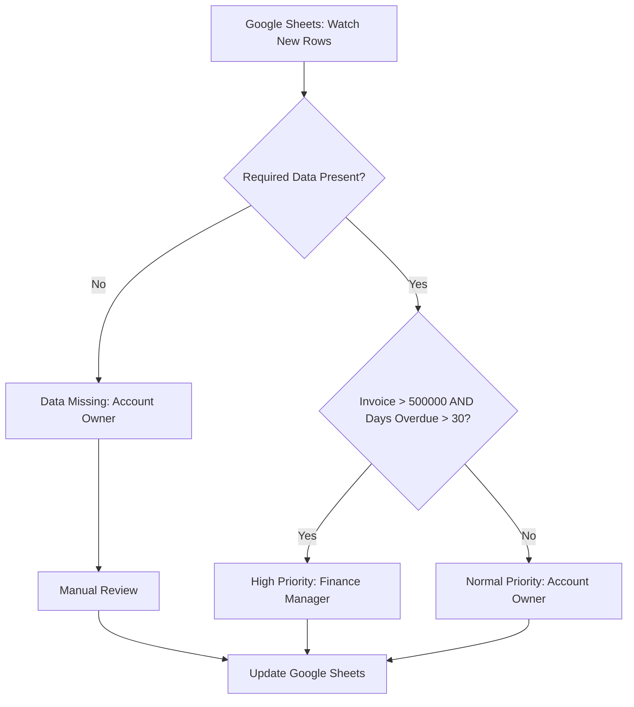
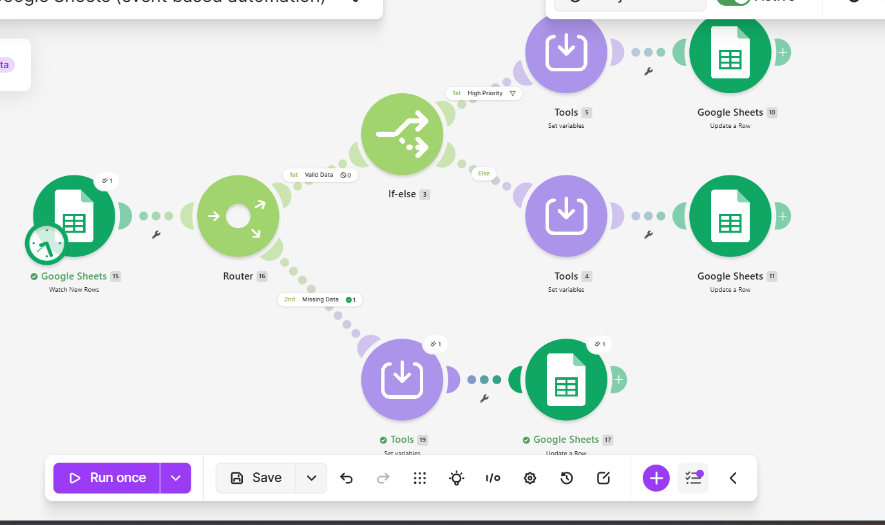
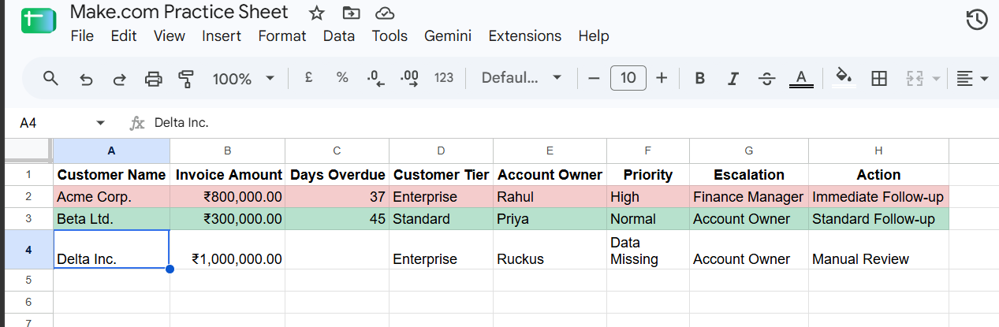

# Collections Automation Engine

A project-driven workflow that identifies overdue invoices, validates required data, assigns collection priorities, and routes follow-up actions using Make.com and Google Sheets.

## 1. Business Problem

Collections teams often review invoice data manually to identify overdue accounts and decide which customers need immediate attention.

Incomplete invoice data can also lead to incorrect prioritisation and inconsistent follow-up.

This workflow demonstrates how business rules and exception handling can automate that initial review and standardise collection actions.

## 2. Solution

The workflow:

1. Watches Google Sheets for newly added invoice rows.
2. Validates that required invoice data is available.
3. Routes incomplete records for manual review.
4. Evaluates complete records against collection priority rules.
5. Assigns a priority and escalation path.
6. Writes the result back to Google Sheets.

The scenario checks for new rows every 15 minutes.

## 3. Project Screenshots

### 1. Make.com Workflow

The complete Make.com scenario shows the trigger, data validation, routing logic, priority evaluation, and Google Sheets updates.

### 2. Final Google Sheets Output

The final output demonstrates the workflow handling different invoice scenarios, including High priority, Normal priority, and Data Missing records.

## 4. Business Rules

| Condition | Priority | Escalation | Action |
|---|---|---|---|
| Invoice amount > ₹5,00,000 AND days overdue > 30 | High | Finance Manager | Immediate Follow-up |
| Complete data but does not meet High criteria | Normal | Account Owner | Standard Follow-up |
| Invoice amount or days overdue is missing | Data Missing | Account Owner | Manual Review |

## 5. Tools Used

- Make.com: Workflow automation, routing, and conditional logic
- Google Sheets: Input data and output tracking

## 6. Validation

The workflow was tested using fictional invoice data across multiple scenarios.

Test cases included:

- A high-value invoice more than 30 days overdue
- A lower-value invoice more than 30 days overdue
- A high-value invoice within 30 days overdue
- A lower-value invoice within 30 days overdue
- An invoice with missing days-overdue data
- Newly added invoices processed by the scheduled trigger

The workflow successfully routed complete records according to the collection rules and flagged incomplete records for manual review.

No production collection or financial system is connected. All demonstration data is fictional.

## 7. Business Value

This prototype demonstrates how collections teams can:

- Standardise invoice prioritisation
- Reduce repetitive manual review
- Identify incomplete data before prioritisation
- Route follow-ups consistently
- Improve visibility into collection actions

## 8. Future Improvements

- Add an AI-generated explanation for each priority decision
- Add duplicate-record detection
- Add error handling and human approval for selected actions
- Track operational metrics such as processing time and overdue balances
- Integrate with a CRM or finance system
